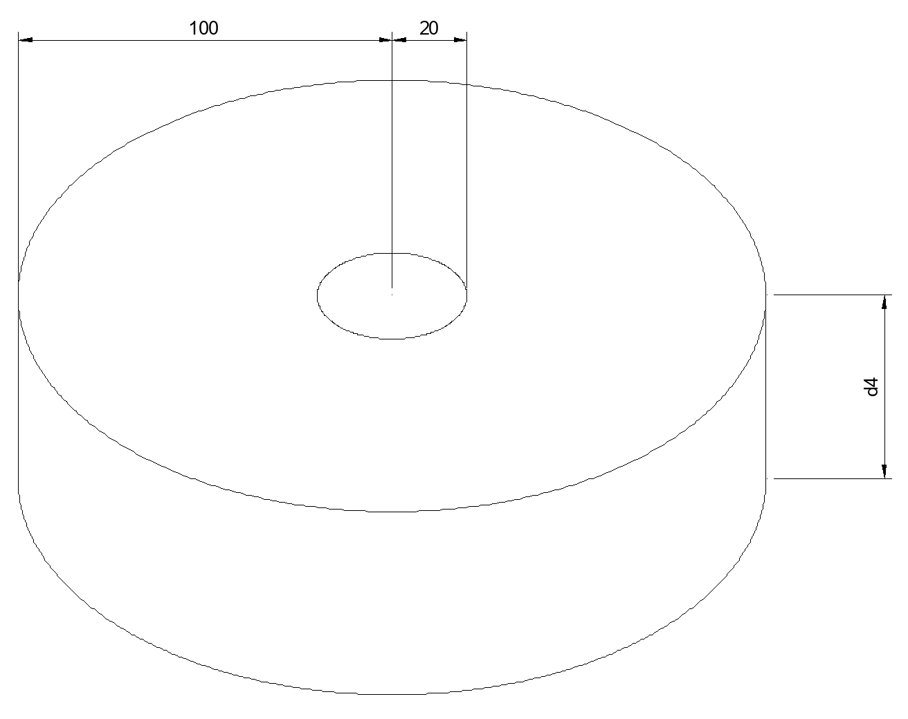

# Midterm - CS 6510
Jonah Boe, Tyler Conley, Ela Bohlourihajar, and Colton Hill

## Problem 1 - Moving in a car


## Problem 2 - Inverse Kinematics, numerical approaches

### *Part A*
The following figure shows the workspace of the robot. All measurments are in (cm).



This means that the workspace volume is:

$ d_4\pi(100-20)^2=20,106.19(cm)^2d_4 $

This remains relative as $d_4$ is not given.

### *Part B*
The DH parameters of the first joint are:

$ \theta_1 =  $

$ a_1 =  $

$ d_1 =  $

$ \alpha_1 =  $

The DH parameters of the second joint are:

$ \theta_2 =  $

$ a_2 =  $

$ d_2 =  $

$ \alpha_2 =  $

The DH parameters of the third joint are:

$ \theta_3 =  $

$ a_3 =  $

$ d_3 =  $

$ \alpha_3 =  $

### *Part C*
In order to compute the forward kinematics of the system if 
$\theta_1 = 30deg, \theta_2 = 45deg, \theta_3 = 90deg$, and $d = 14cm,$ run the following command:
```
python problem02/c.py
```


## Problem 3 - Inverse Kinematics with numerical approaches

### *Part A*
In order to solve this problem we used a genetics algorythm. This algorythm has joint angles as outputs, with proximity to desired endfactor location as feedback for the systems reward function.

### *Part B*
We could then weight the reward function based, adding a penalty for every degree moved. This results in more motion receiving a higher penalty.

### *Part C*
We could then weight the reward function based on which motors are running the most often, penalizing the ones that consume more power.