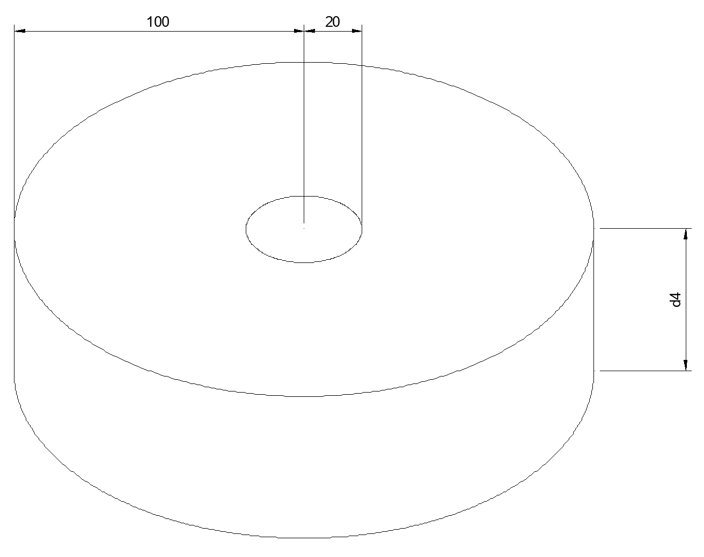

# Forward Kinematics

## Part (a):
The workspace area of the robot is as shown:


## Part (c):
This program simply calculates the forward kinematics for problem 2(c) on the midterm. Run using the command:
```
python c.py
```